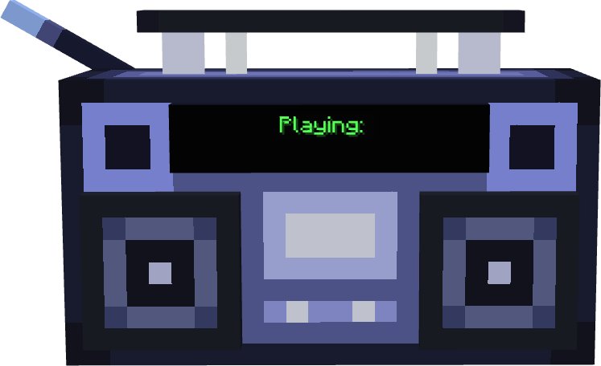
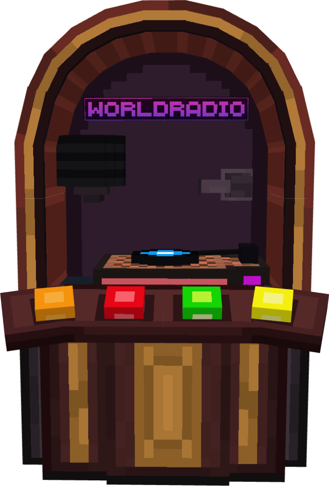

<div align="center">


[](https://minecraft.wiki) [](https://reddev.dev) [](https://reddev.dev) [](#worldradio-song-manager-program) [](#license)

**A synchronized, multi-speaker Minecraft radio network pairing custom Animated Java 3D boomboxes and interactive jukeboxes with NoteBlockStudio music.**

</div>

---

## Table of Contents

- [Key Features](#key-features)
- [WorldRadio Song Manager Program](#worldradio-song-manager-program)
  - [Step-by-Step Guide: How to Use the Manager](#step-by-step-guide-how-to-use-the-manager)
  - [Automated Background Processes](#automated-background-processes)
- [DJ Permission System (WorldRadioDJ Tag)](#dj-permission-system-worldradiodj-tag)
- [In-Game Controls & Commands Reference](#in-game-controls--commands-reference)
  - [3D Boombox](#3d-boombox)
  - [3D Jukebox](#3d-jukebox)
  - [Local Jukebox Zones & Speaker Binding](#local-jukebox-zones--speaker-binding)
  - [Song Notification Modes](#song-notification-modes)
- [System Architecture & How It Works](#system-architecture--how-it-works)
- [NoteBlockStudio Export Guidelines](#noteblockstudio-export-guidelines)
- [Project File Structure](#project-file-structure)
- [Troubleshooting & FAQ](#troubleshooting--faq)
- [Credits & Licenses](#credits--licenses)

---

##  Key Features

- **Multi-Speaker Global Synchronization**: Summon as many boomboxes as you want across your world—all global boomboxes play music and pulse in 100% lockstep.
- **Interactive 3D Jukeboxes with Mesh Networking**: Full Animated Java console models with clickable 3D buttons, moving needle arms, and spinning vinyl records. Nearby jukeboxes connect automatically into a synchronized mesh network.
- **Dedicated Local Jukebox Zones**: Boomboxes placed in range of a Jukebox bind to that Jukebox, granting local venues complete audio autonomy isolated from Global Radio.
- **Standalone GUI Song Manager**: Easily add, update, and remove songs using the included **`WorldRadioManager.exe`** desktop program (no coding or terminal commands required).
- **Interactive Minecraft Dialog GUI**: Features a clean Control Panel (`/function worldradio:radio/help`) with one-click buttons, track selector, radius slider, and full system reset.
- **DJ Role & Permission Protection**: Server-safe control system requiring the `WorldRadioDJ` entity tag to prevent unauthorized players from stopping or skipping music.
- **Live Digital Screens**: High-contrast text displays dynamically show `Playing: <Song Title>` when active and clean standby dots (`......`) when idle.

---

##  WorldRadio Song Manager Program

Included with this project is **`WorldRadioManager.exe`**, a standalone Windows desktop application designed to make managing your radio's playlist effortless.

---

### Step-by-Step Guide: How to Use the Manager

#### 1. Launch the Program
- Double-click **`WorldRadioManager.exe`** (located in the root project folder).
- The program will automatically detect your `worldradio datapack` directory. *(If moved, you can use the **Browse...** button to select it manually).*

#### 2. Import / Add a Song
1. Export your song from **NoteBlockStudio** as a `.zip` archive or datapack folder.
2. In the WorldRadio Manager, click **Browse File...** and select your `.zip` file.
3. The **Display Title** box will automatically fill in a clean title (e.g. `steam_gardens.zip` $\rightarrow$ `Steam Gardens`). You can edit this title to whatever you'd like displayed in-game.
4. Click **Import Song**.
5. Once the success notification appears, open Minecraft and type:
   ```mcfunction
   /reload
   ```

#### 3. Update an Existing Song
- If you made changes to a song in NoteBlockStudio and re-exported it, simply select the new `.zip` file with the same song name and click **Import Song**. The manager will overwrite the old song files and update the playlist automatically.

#### 4. Remove a Song
1. In the **Installed Playlist** list, click on the song you wish to delete.
2. Click **Remove Selected Song**.
3. Confirm the prompt. The manager will delete the song connectors, automatically re-index the remaining playlist, and update the song count.
4. Type `/reload` in Minecraft.

---

### Automated Background Processes

When you import a song, `WorldRadioManager.exe` performs all technical setup behind the scenes:
1. **Archive Extraction**: Unpacks the ZIP and copies note functions to `data/worldradio/function/songs/<song>/`.
2. **Audio Sanitization**: Scans all note files and automatically converts invalid uppercase sound event identifiers (e.g. NoteBlockStudio's `minecraft:Fizz`) into valid Minecraft lowercase identifiers (`minecraft:block.fire.extinguish`).
3. **Scoreboard Objective Detection**: Scans the song's `load.mcfunction` to identify its exact objective (`nbs_<name>_t`).
4. **Length & Tick Calculation**: Analyzes all note tree branches to calculate the exact max tick duration for seamless auto-advance.
5. **Connector Generation**: Creates custom `play.mcfunction`, `pause.mcfunction`, `resume.mcfunction`, and `stop.mcfunction` connectors for that song.
6. **Global Dispatcher Rebuilding**: Rebuilds the global playback dispatcher, local zone mesh dispatchers, text display updater, and actionbar announcers.

---

##  DJ Permission System (WorldRadioDJ Tag)

To keep server environments, multiplayer worlds, and events organized, **all WorldRadio controls require the `WorldRadioDJ` tag**.

### How to Assign or Remove the DJ Role:

| Action | Command Syntax | Description |
|---|---|---|
| **Give Yourself DJ Role** | `/tag @s add WorldRadioDJ` | Grants you full control over radio playback |
| **Give Another Player DJ Role** | `/tag <player_name> add WorldRadioDJ` | Grants another player DJ permissions |
| **Revoke DJ Role** | `/tag <player_name> remove WorldRadioDJ` | Removes DJ permissions from that player |

> [!NOTE]
> If a player without the `WorldRadioDJ` tag attempts to run radio commands or click dialog buttons, execution will immediately halt with a notice:
> `[WorldRadio] You need the WorldRadioDJ tag to use this command.`

---

##  In-Game Controls & Commands Reference

<div align="center">


</div>

All commands require the `WorldRadioDJ` tag to execute.

| Action | In-Game Command | Description |
|---|---|---|
| **Control Panel (GUI)** | `/function worldradio:radio/help`<br>*(or `/dialog show @s worldradio:help`)* | Opens the official Minecraft Modal Dialog GUI with clickable buttons |
| **Summon Boombox** | `/function worldradio:summon_boombox` | Summons an Animated Java boombox model at your location |
| **Remove Nearest Boombox** | `/function worldradio:remove_boombox` | Removes the nearest single boombox (within 5 blocks) |
| **Remove Zone Boomboxes** | `/function worldradio:remove_zone_boomboxes` | Removes all local boomboxes listening to the jukebox in your area |
| **Remove All Boomboxes** | `/function worldradio:remove_all_boomboxes` | Removes every boombox model from the entire world |
| **Summon Jukebox** | `/function worldradio:summon_jukebox` | Summons an interactive 3D animated Jukebox model |
| **Remove Nearest Jukebox** | `/function worldradio:remove_jukebox` | Removes the nearest Jukebox model (within 5 blocks) |
| **Remove All Jukeboxes** | `/function worldradio:remove_all_jukeboxes` | Removes every Jukebox model from the entire world |
| **Global Play** | `/function worldradio:radio/play` | Starts or resumes song playback on all global boomboxes |
| **Global Pause** | `/function worldradio:radio/pause` | Pauses global playback at current timestamp |
| **Global Stop** | `/function worldradio:radio/stop` | Stops global playback, resets position to tick 0, clears displays |
| **Global Next / Prev** | `/function worldradio:radio/next`<br>`/function worldradio:radio/previous` | Advances or retreats through global tracks |
| **Global Shuffle** | `/function worldradio:radio/shuffle` | Picks a random song from playlist for Global Radio |
| **Play Jukeboxes** | `/function worldradio:jukebox/control/play` | Starts playback and needle drops across all Jukebox zones |
| **Stop Jukeboxes** | `/function worldradio:jukebox/control/stop` | Halts music and lifts needles across all Jukebox zones |
| **Next / Prev Track** | `/function worldradio:jukebox/control/next`<br>`/function worldradio:jukebox/control/prev` | Swaps vinyl disc and changes track across all Jukebox zones |
| **Jukebox Shuffle** | `/function worldradio:jukebox/control/shuffle` | Picks a random song from playlist for Jukebox zones |
| **Set Zone Radius** | `/function worldradio:jukebox/set_radius` | Sets custom zone radius in blocks |
| **Toggle Notifications** | `/function worldradio:radio/toggle_announce` | Cycles song announcements: `Both` $\rightarrow$ `Actionbar` $\rightarrow$ `Chat` $\rightarrow$ `None` |
| **Reset Everything** | `/function worldradio:reset` | Resets all playback, model bones, scores, and displays |

---

### 3D Boombox

<table>
<tr>
<td width="30%" align="center">

</td>
<td width="70%" valign="middle">

Summon using `/function worldradio:summon_boombox`.

* **Live LCD Screen**: Displays the current song title when playing, or bold white standby dots (`......`) when idle.
* **Animated Speakers**: Subwoofers pulse and bounce in sync with the music.
* **Smart Placement Binding**: Plays Global Radio by default, or permanently links to a local Jukebox when placed in its zone.

</td>
</tr>
</table>

---

### 3D Jukebox

<table>
<tr>
<td width="30%" align="center">

</td>
<td width="70%" valign="middle">

Summon using `/function worldradio:summon_jukebox`.

* **Interactive Buttons**: Right-click 3D buttons to Play, Stop, Next, or Previous.
* **Animated Turntable**: Vinyl record player with moving needle arm and spinning discs.
* **Mesh Syncing**: Neighboring Jukeboxes in range automatically link and spin together.

</td>
</tr>
</table>

---

### Local Jukebox Zones & Speaker Binding

- **Local Zone Autonomy**: Jukeboxes maintain complete authority over sound in their area.
- **Placement-Bound Architecture**:
  - **Placed near a Jukebox**: When a Boombox is placed within a Jukebox's radius (default: 20 blocks), it permanently binds to that Jukebox. It plays the local track when the Jukebox is active, and stays silenced on standby (`......`) when the Jukebox is stopped. It is completely isolated from Global Radio commands.
  - **Placed outside**: Boomboxes placed away from Jukeboxes connect to Global Radio and respond to server-wide radio playback.
- **Easy Reconfiguration**: To move a speaker between local and global channels, simply break it and place it down in your desired zone, or use `/function worldradio:remove_zone_boomboxes` to quickly clear all local speakers in an area.

---

### Song Notification Modes

Customize how song changes are announced to players when playback starts or switches:

| Notification Mode | Description | Direct Command |
|---|---|---|
| **Both** *(Default)* | Shows `Now Playing: <Song>` on the player actionbar **and** sends a message to chat. | `/function worldradio:radio/set_announce_both` |
| **Actionbar Only** | Displays `Now Playing: <Song>` on player actionbars with zero chat log clutter. | `/function worldradio:radio/set_announce_actionbar` |
| **Chat Only** | Sends `[WorldRadio] Now Playing: <Song>` into the chat log without actionbar text. | `/function worldradio:radio/set_announce_chat` |
| **None (Silent)** | Completely silent notifications (boomboxes still play music and show text on screen). | `/function worldradio:radio/set_announce_none` |

---

##  System Architecture & How It Works

```
┌─────────────────────────────────────────────────────────────────────────┐
│                           WorldRadio Core                               │
│                                                                         │
│   ┌─────────────────────┐                     ┌─────────────────────┐   │
│   │    Animated Java    │                     │  NoteBlockStudio    │   │
│   │  Boombox & Jukebox  │                     │     Song Files      │   │
│   │     (data/aj/)      │                     │ (data/worldradio/)  │   │
│   └──────────┬──────────┘                     └──────────┬──────────┘   │
│              │                                           │              │
│              └─────────────────────┬─────────────────────┘              │
│                                    ▼                                    │
│                 ┌─────────────────────────────────────┐                 │
│                 │       WorldRadio Dispatcher         │                 │
│                 │   • Global Radio Broadcast          │                 │
│                 │   • Local Jukebox Mesh Network      │                 │
│                 └──────────────────┬──────────────────┘                 │
│                                    │                                    │
│              ┌─────────────────────┴─────────────────────┐              │
│              ▼                                           ▼              │
│   ┌─────────────────────┐                     ┌─────────────────────┐   │
│   │  Live Screen Text   │                     │ Actionbar Announce  │   │
│   │  on Boombox Models  │                     │   to all Players    │   │
│   └─────────────────────┘                     └─────────────────────┘   │
└─────────────────────────────────────────────────────────────────────────┘
```

1. **Pure Separation of Concerns**:
   - `data/aj/` and `data/animated_java/` are **pure Animated Java exports**. Custom radio code never edits these files, meaning you can update your Blockbench model at any time and re-export without breaking radio logic.
   - NoteBlockStudio note trees in `data/worldradio/function/songs/<song>/` are pure audio pipelines.
   - All controller logic, playlist state tracking, and scoreboard dispatchers live safely in `data/worldradio/function/radio/` and `data/worldradio/function/jukebox/`.

2. **1x Normal Speed Guarantee**:
   - Centralized per-tick execution ensures that every boombox and jukebox entity advances its song clock by `+speed` exactly once per game tick, guaranteeing pristine audio clarity with zero double-speed or phase distortion regardless of how many devices overlap.

---

##  NoteBlockStudio Export Guidelines

When exporting songs from NoteBlockStudio to use with WorldRadio:
- **Export Format**: Select **Datapack (Structure/Functions)** or **ZIP Archive**.
- **Quantization**: Leave default tempo quantization enabled (20 ticks/second).
- **Microtick Optimization**: Enabled by default in NBS exports.
- **Importing**: Place the exported `.zip` file anywhere on your computer, open **`WorldRadioManager.exe`**, select the ZIP, and click **Import Song**.

---

##  Project File Structure

```
World Radio/
├── assets/                       # Documentation images & banner assets
│   ├── title.png                 # Header banner
│   ├── boombox.png               # 3D Boombox showcase image
│   ├── jukebox.png               # 3D Jukebox showcase image
│   └── control_panel.png         # Control panel GUI screenshot
├── WorldRadioManager.exe         # Standalone GUI Playlist & Song Manager
├── WorldRadioManager.cs          # C# Source code for WorldRadioManager
├── README.md                     # Complete documentation & guide
├── LICENSE                       # CC BY-NC 4.0 License
│
├── worldradio datapack/          # Pure Minecraft Datapack
│   ├── pack.mcmeta               # Datapack metadata (by Reddev)
│   ├── data.ajmeta               # Animated Java metadata
│   └── data/
│       ├── aj/                   # Pure Animated Java exports (DO NOT EDIT)
│       ├── animated_java/        # Pure Animated Java runtime (DO NOT EDIT)
│       ├── minecraft/tags/       # Function load & tick tags
│       └── worldradio/
│           ├── dialog/           # Minecraft Modal Dialog GUI definitions
│           │   └── help.json     # Control panel GUI definition
│           └── function/
│               ├── reset.mcfunction                  # Complete system reset
│               ├── summon_boombox.mcfunction
│               ├── remove_boombox.mcfunction
│               ├── remove_all_boomboxes.mcfunction   # Remove all world boomboxes
│               ├── remove_zone_boomboxes.mcfunction  # Remove local zone speakers
│               ├── summon_jukebox.mcfunction
│               ├── remove_jukebox.mcfunction
│               ├── remove_all_jukeboxes.mcfunction   # Remove all world jukeboxes
│               ├── load.mcfunction
│               ├── tick.mcfunction
│               ├── jukebox/      # Local zone mesh & 3D animation controllers
│               ├── radio/        # Global radio controllers & playlist engine
│               └── songs/        # NoteBlockStudio song notes & dispatchers
│
└── worldradio resourcepack/      # Pure Minecraft Resource Pack
    ├── pack.mcmeta               # Resource pack metadata (by Reddev)
    ├── pack.png                  # Resource pack icon
    ├── assets.ajmeta             # Animated Java metadata
    └── assets/
        ├── aj/                   # 3D models & textures for Boombox and Jukebox
        └── minecraft/            # Custom note block instrument sounds
```

---

##  Troubleshooting & FAQ

#### Q: I get "You need the WorldRadioDJ tag to use this command."
> **Fix**: Grant yourself the DJ role by typing:
> ```mcfunction
> /tag @s add WorldRadioDJ
> ```

#### Q: I placed multiple jukeboxes next to each other. How do they sync?
> **Fix**: Jukeboxes within radius distance automatically join into a mesh network. Pressing Play, Stop, Next, or Prev on any console will animate all neighboring consoles and keep songs synchronized in 1x lockstep.

#### Q: How do I reset all music and restore all models to resting pose?
> **Fix**: Click the **🔄 Reset Everything** button at the bottom of the Control Panel (`/function worldradio:radio/help`) or run `/function worldradio:reset`.

---

##  Credits & Licenses

### Credits
- **Creator & Developer**: [Reddev](https://reddev.dev)
- **Website**: [https://reddev.dev](https://reddev.dev)
- **Documentation Icons**: [Datapack Icons (`mc-dp-icons`)](https://github.com/FuncFusion/mc-dp-icons) by [FuncFusion](https://github.com/FuncFusion)
- **Model Animation Framework**: [Animated Java](https://animated-java.dev)
- **Music & Sound Generation**: [Open Note Block Studio](https://opennbs.org)

### License
This project is licensed under the **Creative Commons Attribution-NonCommercial 4.0 International (CC BY-NC 4.0)** License.

- **You are free to**: Look at, download, use, modify, and build upon this project for non-commercial purposes.
- **Attribution Required**: You must provide appropriate credit to **Reddev** and link to [https://reddev.dev](https://reddev.dev).
- **Non-Commercial**: You **cannot** sell, monetize, or distribute this project or derivatives for commercial gain.

For the full legal code, see the [`LICENSE`](LICENSE) file.
