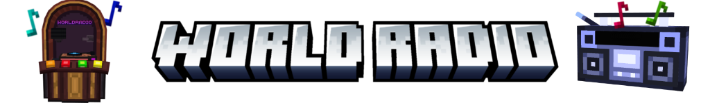
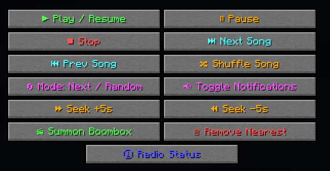

<div align="center">



[](https://minecraft.wiki) [](https://reddev.dev) [](https://reddev.dev) [](#worldradio-song-manager-program) [](#license)

**A synchronized, multi-speaker Minecraft radio network pairing custom Animated Java 3D boombox models with NoteBlockStudio music.**

</div>

---

## Table of Contents

- [Key Features](#key-features)
- [WorldRadio Song Manager Program](#worldradio-song-manager-program)
  - [Step-by-Step Guide: How to Use the Manager](#step-by-step-guide-how-to-use-the-manager)
  - [Automated Background Processes](#automated-background-processes)
- [DJ Permission System (WorldRadioDJ Tag)](#dj-permission-system-worldradiodj-tag)
- [In-Game Controls & Commands Reference](#in-game-controls--commands-reference)
  - [Song Notification Modes](#song-notification-modes)
- [System Architecture & How It Works](#system-architecture--how-it-works)
- [NoteBlockStudio Export Guidelines](#noteblockstudio-export-guidelines)
- [Blockbench & 3D Model Setup](#blockbench--3d-model-setup)
- [Command-Line Alternative (PowerShell)](#command-line-alternative-powershell)
- [Project File Structure](#project-file-structure)
- [Troubleshooting & FAQ](#troubleshooting--faq)
- [Credits & Licenses](#credits--licenses)

---

##  Key Features

- **Multi-Speaker Global Synchronization**: Summon as many boomboxes as you want across your world—all boombox models play music and display animations in 100% lockstep.
- **Standalone GUI Song Manager**: Easily add, update, and remove songs using the included **`WorldRadioManager.exe`** desktop program (no coding or terminal commands required).
- **In-Game Modal GUI Control Panel**: Features an interactive Minecraft Dialog GUI screen (`/function worldradio:radio/help`) with one-click control buttons.
- **DJ Role & Permission Protection**: Server-safe control system requiring the `WorldRadioDJ` entity tag to prevent unauthorized players from stopping or skipping music.
- **Live Screen & Actionbar Notifications**: Digital text display on every boombox model and player actionbar dynamically shows `Now Playing: <Song Title>`.
- **100% Non-Destructive Modding**: Animated Java model folders (`data/aj/`) and NoteBlockStudio note folders are kept untouched, allowing seamless model re-exports from Blockbench anytime.

---

##  WorldRadio Song Manager Program

Included with this project is **`WorldRadioManager.exe`**, a standalone Windows desktop application designed to make managing your radio's playlist effortless.

---

### Step-by-Step Guide: How to Use the Manager

#### 1. Launch the Program
- Double-click **`WorldRadioManager.exe`** (located in the root project folder).
- The program will automatically detect your `worldradio datapack` directory. *(If moved, you can use the **Browse...** button to select it manually).*

#### 2. Import / Add a Song
1. Export your song from **NoteBlockStudio** as a `.zip` archive or datapack folder.
2. In the WorldRadio Manager, click **Browse File...** and select your `.zip` file.
3. The **Display Title** box will automatically fill in a clean title (e.g. `steam_gardens.zip` $\rightarrow$ `Steam Gardens`). You can edit this title to whatever you'd like displayed in-game.
4. Click **Import Song**.
5. Once the success notification appears, open Minecraft and type:
   ```mcfunction
   /reload
   ```

#### 3. Update an Existing Song
- If you made changes to a song in NoteBlockStudio and re-exported it, simply select the new `.zip` file with the same song name and click **Import Song**. The manager will overwrite the old song files and update the playlist automatically.

#### 4. Remove a Song
1. In the **Installed Playlist** list, click on the song you wish to delete.
2. Click **Remove Selected Song**.
3. Confirm the prompt. The manager will delete the song connectors, automatically re-index the remaining playlist, and update the song count.
4. Type `/reload` in Minecraft.

---

### Automated Background Processes

When you import a song, `WorldRadioManager.exe` performs all technical setup behind the scenes:
1. **Archive Extraction**: Unpacks the ZIP and copies note functions to `data/worldradio/function/songs/<song>/`.
2. **Audio Sanitization**: Scans all note files and automatically converts invalid uppercase sound event identifiers (e.g. NoteBlockStudio's `minecraft:Fizz`) into valid Minecraft lowercase identifiers (`minecraft:block.fire.extinguish`).
3. **Scoreboard Objective Detection**: Scans the song's `load.mcfunction` to identify its exact objective (`nbs_<name>_t`).
4. **Length & Tick Calculation**: Analyzes all note tree branches to calculate the exact max tick duration for seamless auto-advance.
5. **Connector Generation**: Creates custom `play.mcfunction`, `pause.mcfunction`, `resume.mcfunction`, and `stop.mcfunction` connectors for that song.
6. **Global Dispatcher Rebuilding**: Rebuilds the global playback dispatcher, text display updater, actionbar announcer, and status summaries.

---

##  DJ Permission System (WorldRadioDJ Tag)

To keep server environments, multiplayer worlds, and events organized, **all WorldRadio controls require the `WorldRadioDJ` tag**.

### How to Assign or Remove the DJ Role:

| Action | Command Syntax | Description |
|---|---|---|
| **Give Yourself DJ Role** | `/tag @s add WorldRadioDJ` | Grants you full control over radio playback |
| **Give Another Player DJ Role** | `/tag <player_name> add WorldRadioDJ` | Grants another player DJ permissions |
| **Revoke DJ Role** | `/tag <player_name> remove WorldRadioDJ` | Removes DJ permissions from that player |

> [!NOTE]
> If a player without the `WorldRadioDJ` tag attempts to run radio commands or click dialog buttons, execution will immediately halt with a notice:
> `[WorldRadio] You need the WorldRadioDJ tag to use this command.`

---

##  In-Game Controls & Commands Reference

<div align="center">



</div>

All commands require the `WorldRadioDJ` tag to execute.

| Action | In-Game Command | Description |
|---|---|---|
| **Control Panel (GUI)** | `/function worldradio:radio/help`<br>*(or `/dialog show @s worldradio:help`)* | Opens the official Minecraft Modal Dialog GUI with clickable buttons |
| **Chat Controls** | `/function worldradio:chat_help` | Displays clickable control buttons inside your chat window |
| **Summon Boombox** | `/function worldradio:summon_boombox` | Summons an Animated Java boombox model at your location |
| **Remove Nearest Boombox** | `/function worldradio:remove_boombox` | Removes the nearest boombox model (within 5 blocks) |
| **Remove All Boomboxes** | `/function worldradio:remove_all_boomboxes` | Removes all boomboxes currently in the world |
| **Play / Resume** | `/function worldradio:radio/play` | Starts or resumes song playback on all boomboxes |
| **Pause** | `/function worldradio:radio/pause` | Pauses playback at the current song timestamp |
| **Stop** | `/function worldradio:radio/stop` | Stops playback, resets position to tick 0, clears displays |
| **Next Song** | `/function worldradio:radio/next` | Advances to the next song in sequential order |
| **Previous Song** | `/function worldradio:radio/previous` | Goes back to the previous song in sequential order |
| **Shuffle Song** | `/function worldradio:radio/shuffle` | Picks a random song from the playlist (advances if same) |
| **Toggle Auto-Play Mode** | `/function worldradio:radio/toggle_shuffle` | Toggles between Sequential and Shuffle mode when songs end |
| **Toggle Notifications** | `/function worldradio:radio/toggle_announce` | Cycles song announcements: `Both` $\rightarrow$ `Actionbar` $\rightarrow$ `Chat` $\rightarrow$ `None` |
| **Seek +5s** | `/function worldradio:radio/seek_forward` | Seeks forward 100 ticks (5 seconds) |
| **Seek -5s** | `/function worldradio:radio/seek_backward` | Seeks backward 100 ticks (5 seconds) |
| **Custom Seek** | `/function worldradio:radio/seek_by {ticks: 200}` | Seeks by any custom tick count (+forward / -backward) |
| **Radio Status** | `/function worldradio:radio/status` | Displays radio state, current song title, mode, and boombox count |

### Song Notification Modes

Customize how song changes are announced to players when playback starts or switches:

| Notification Mode | Description | Direct Command |
|---|---|---|
| **Both** *(Default)* | Shows `Now Playing: <Song>` on the player actionbar **and** sends a message to chat. | `/function worldradio:radio/set_announce_both` |
| **Actionbar Only** | Displays `Now Playing: <Song>` on player actionbars with zero chat log clutter. | `/function worldradio:radio/set_announce_actionbar` |
| **Chat Only** | Sends `[WorldRadio] Now Playing: <Song>` into the chat log without actionbar text. | `/function worldradio:radio/set_announce_chat` |
| **None (Silent)** | Completely silent notifications (boomboxes still play music and show text on screen). | `/function worldradio:radio/set_announce_none` |

> [!TIP]
> You can quickly cycle through all 4 modes by clicking **`📢 Toggle Notifications`** in the Control Panel GUI (`/function worldradio:radio/help`) or by running `/function worldradio:radio/toggle_announce`.

---

##  System Architecture & How It Works

```
┌─────────────────────────────────────────────────────────────┐
│                      WorldRadio Core                        │
│                                                             │
│   ┌─────────────────────┐         ┌─────────────────────┐   │
│   │    Animated Java    │         │  NoteBlockStudio    │   │
│   │    Boombox Model    │         │     Song Files      │   │
│   │     (data/aj/)      │         │ (data/worldradio/)  │   │
│   └──────────┬──────────┘         └──────────┬──────────┘   │
│              │                               │              │
│              └───────────────┬───────────────┘              │
│                              ▼                              │
│               ┌─────────────────────────────┐               │
│               │   Global Radio Dispatcher   │               │
│               │     & Multi-Speaker Sync    │               │
│               └──────────────┬──────────────┘               │
│                              │                              │
│              ┌───────────────┴───────────────┐              │
│              ▼                               ▼              │
│   ┌─────────────────────┐         ┌─────────────────────┐   │
│   │  Live Screen Text   │         │ Actionbar Announce  │   │
│   │     on Boombox      │         │   to all Players    │   │
│   └─────────────────────┘         └─────────────────────┘   │
└─────────────────────────────────────────────────────────────┘
```

1. **Pure Separation of Concerns**:
   - `data/aj/` and `data/animated_java/` are **pure Animated Java exports**. Custom radio code never edits these files, meaning you can update your Blockbench model at any time and re-export without breaking radio logic.
   - NoteBlockStudio note trees in `data/worldradio/function/songs/<song>/` are pure audio pipelines.
   - All controller logic, playlist state tracking, and scoreboard dispatchers live safely in `data/worldradio/function/radio/`.

2. **Auto-Syncing Newly Summoned Boomboxes**:
   - If music is already playing and a player summons a new boombox, the system automatically binds the new entity to the active song clock, starts its playing animation on the correct frame, and writes the active song title to its digital screen.

3. **Tempo & Microtick Quantization**:
   - NoteBlockStudio automatically quantizes exported songs to 20 ticks per second. Playback speeds can be dynamically varied by adjusting the `speed nbs_<song>` scoreboard objective.

---

##  NoteBlockStudio Export Guidelines

When exporting songs from NoteBlockStudio to use with WorldRadio:
- **Export Format**: Select **Datapack (Structure/Functions)** or **ZIP Archive**.
- **Quantization**: Leave default tempo quantization enabled (20 ticks/second).
- **Microtick Optimization**: Enabled by default in NBS exports.
- **Importing**: Place the exported `.zip` file anywhere on your computer, open **`WorldRadioManager.exe`**, select the ZIP, and click **Import Song**.

---

##  Command-Line Alternative (PowerShell)

If you prefer using the command line instead of the GUI program, PowerShell scripts are included:

### Add / Update Song:
```powershell
.\add_song.ps1 "C:\Path\To\Song.zip" "Display Title"
```
*Example:*
```powershell
.\add_song.ps1 "C:\Users\devus\Downloads\steam_gardens.zip" "Steam Gardens"
```

### Remove Song:
```powershell
.\remove_song.ps1 <song_folder_name>
```
*Example:*
```powershell
.\remove_song.ps1 steam_gardens
```

---

##  Project File Structure

```
World Radio/
├── assets/                       # Documentation images & banner assets
│   ├── title.png                 # Header banner
│   └── control_panel.png         # Control panel GUI screenshot
├── WorldRadioManager.exe         # Standalone GUI Playlist & Song Manager
├── WorldRadioManager.cs          # C# Source code for WorldRadioManager
├── README.md                     # Complete documentation & guide
├── LICENSE                       # CC BY-NC 4.0 License
├── add_song.ps1                  # CLI song importer script
├── remove_song.ps1               # CLI song remover script
│
├── worldradio datapack/          # Pure Minecraft Datapack
│   ├── pack.mcmeta               # Datapack metadata (by Reddev)
│   ├── data.ajmeta               # Animated Java metadata
│   └── data/
│       ├── aj/                   # Pure Animated Java exports (DO NOT EDIT)
│       ├── animated_java/        # Pure Animated Java runtime (DO NOT EDIT)
│       ├── minecraft/tags/       # Function load & tick tags
│       └── worldradio/
│           ├── dialog/           # Minecraft Modal Dialog GUI definitions
│           │   └── help.json     # Control panel GUI definition
│           └── function/
│               ├── summon_boombox.mcfunction
│               ├── remove_boombox.mcfunction
│               ├── remove_all_boomboxes.mcfunction
│               ├── load.mcfunction
│               ├── tick.mcfunction
│               ├── radio/        # Playback controllers & playlist engine
│               └── songs/        # NoteBlockStudio song notes & dispatchers
│
└── worldradio resourcepack/      # Pure Minecraft Resource Pack
    ├── pack.mcmeta               # Resource pack metadata (by Reddev)
    ├── pack.png                  # Resource pack icon
    ├── assets.ajmeta             # Animated Java metadata
    └── assets/
        └── aj/
            ├── models/           # Exported boombox display models
            └── textures/blueprint/worldradio_boombox/
                └── boombox_base.png # Boombox texture
```

---

##  Troubleshooting & FAQ

#### Q: I get "You need the WorldRadioDJ tag to use this command."
> **Fix**: Grant yourself the DJ role by typing:
> ```mcfunction
> /tag @s add WorldRadioDJ
> ```

#### Q: The boombox model shows a purple and black checkerboard texture.
> **Fix**: Ensure `boombox_base.png` is placed in `worldradio resourcepack/assets/aj/textures/blueprint/worldradio_boombox/boombox_base.png` (not in the `models/` directory) and press **F3 + T** to reload resource packs.

#### Q: I imported a song, but it doesn't show up in game.
> **Fix**: Run `/reload` in chat. If you added the song while playing in singleplayer, rejoining the world ensures all client and server caches refresh.

---

##  Credits & Licenses

### Credits
- **Creator & Developer**: [Reddev](https://reddev.dev)
- **Website**: [https://reddev.dev](https://reddev.dev)
- **Documentation Icons**: [Datapack Icons (`mc-dp-icons`)](https://github.com/FuncFusion/mc-dp-icons) by [FuncFusion](https://github.com/FuncFusion)
- **Model Animation Framework**: [Animated Java](https://animated-java.dev)
- **Music & Sound Generation**: [Open Note Block Studio](https://opennbs.org)

### License
This project is licensed under the **Creative Commons Attribution-NonCommercial 4.0 International (CC BY-NC 4.0)** License.

- **You are free to**: Look at, download, use, modify, and build upon this project for non-commercial purposes.
- **Attribution Required**: You must provide appropriate credit to **Reddev** and link to [https://reddev.dev](https://reddev.dev).
- **Non-Commercial**: You **cannot** sell, monetize, or distribute this project or derivatives for commercial gain.

For the full legal code, see the [`LICENSE`](LICENSE) file.
